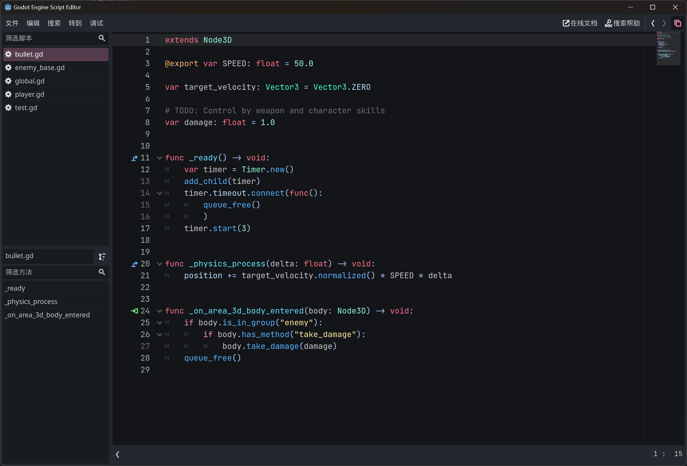
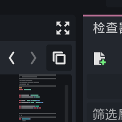

# Godot Float Script Editor

Godot engine plugin to detach script editor window.

## Getting started

1. Download this repository and copy `addons/float_script_editor` to your root Godot directory under `res://`.
2. Enable the plugin inside `Project/Project Setttings/Plugins`
3. You will see a button in script editor, click to detach/attach script window:

## Contribute

Any contributions is welcome! If you find any bugs, please report in `issues`.